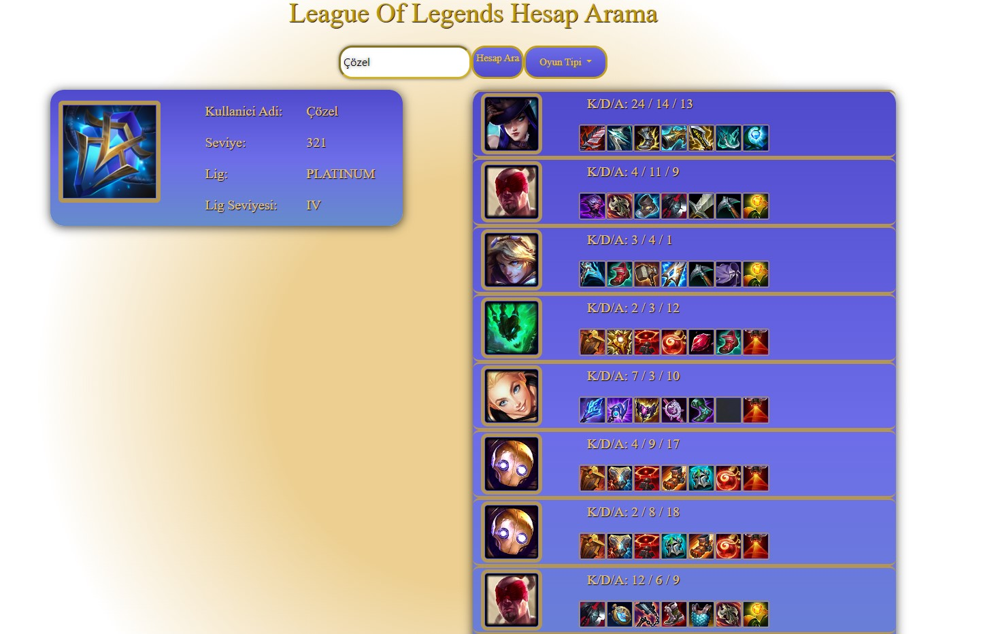
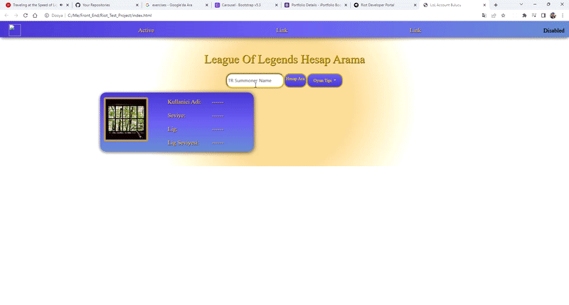

 

# Proje Hakkında

Bu proje, League of Legends hesap arama uygulaması için yazılmış bir JavaScript, HTML ve CSS dosyası içerir. API kullanımı konusunda tecrübe edinme amaçlı yazdığım bir deneme projesidir. Dosya içindeki kodlar HTML sayfasındaki elementlere erişerek bu elementlerin değerlerini değiştirir. 

## Proje içerisindeki JavaScript fonksiyonları şunlardır:

- getSummonerData(): Bu fonksiyon, kullanıcının girdiği isimle bir hesap arar ve bu hesabın seviyesi, ligi ve lig seviyesi gibi bilgileri gösterir.
- getMatchHistory(): Bu fonksiyon, kullanıcının girdiği isimle bir hesap arar ve bu hesabın son 10 maçını gösterir.
- getChampionIcon(): Bu fonksiyon, kullanıcının son 10 maçında kullandığı şampiyonların resimlerini gösterir.
- getItemIcon(): Bu fonksiyon, kullanıcının son 10 maçında kullandığı itemlerin resimlerini gösterir.

## Proje içerisindeki event listener’lar şunlardır:

- buttonSearch.addEventListener('click', getSummonerData): Bu event listener, “Hesap Ara” butonuna tıklandığında getSummonerData() fonksiyonunu çağırır.
- buttonFlex.addEventListener('click', getMatchHistory): Bu event listener, “Dereceli 5v5 Esnek” butonuna tıklandığında getMatchHistory() fonksiyonunu çağırır.
- buttonSolo.addEventListener('click', getMatchHistory): Bu event listener, “Dereceli 5v5 Tekli” butonuna tıklandığında getMatchHistory() fonksiyonunu çağırır.
- buttonNomral.addEventListener('click', getMatchHistory): Bu event listener, “Normal 5v5” butonuna tıklandığında getMatchHistory() fonksiyonunu çağırır.

 

Dosya içindeki kodlar HTML sayfasındaki elementlere erişerek bu elementlerin değerlerini değiştirir. Örneğin; document.getElementById("accName").innerHTML = summonerName; kodu ile HTML sayfasındaki “accName” id’li elementin içeriği değiştirilir."